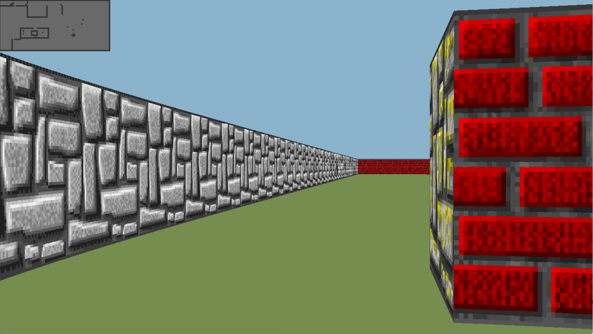
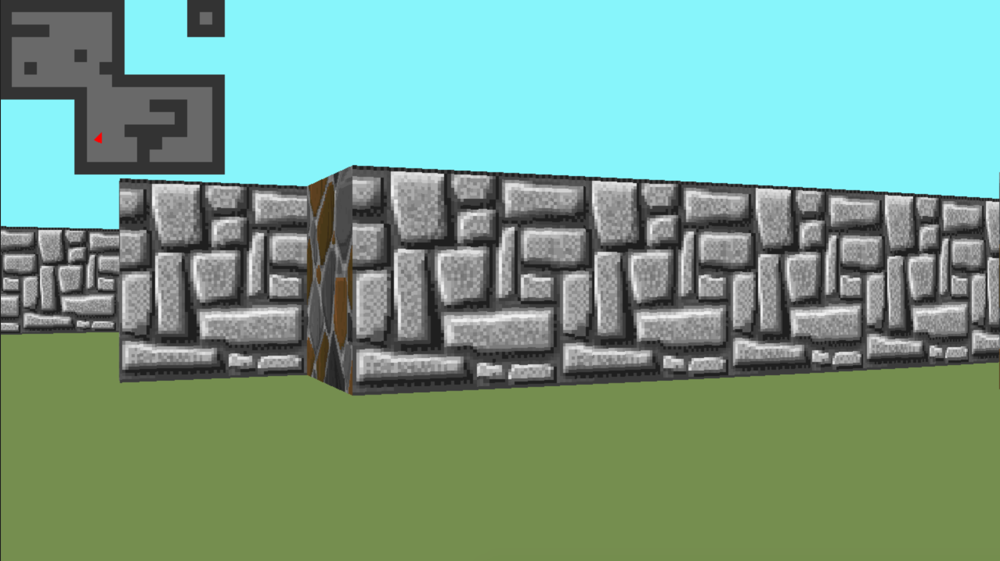

# 19_cub3d
This project is inspired by the world-famous eponymous 90's game, which was the first FPS ever. It will enable you to explore ray-casting. Your goal will be to make a dynamic view inside a maze, in which you'll have to find your way. 

Done with goffauxs (github.com/goffauxs)

make
./cub3D <path to map>

◦ The map must be composed of only 6 possible characters: 0 for an empty space, 1 for a wall, and N,S,E or W for the player’s start position and spawning orientation.
◦ The map must be closed/surrounded by walls.
◦ Except for the map content, each type of element can be separated by one or more empty line(s).
◦ Except for the map content which always has to be the last, each type of element can be set in any order in the file.
◦ Except for the map, each type of information from an element can be separated by one or more space(s).

◦ The left and right arrow --> to look left and right in the maze.
◦ The W, A, S, and D keys --> move the point of view through the maze.
◦ Pressing ESC or --> close the window and quit the program cleanly.

